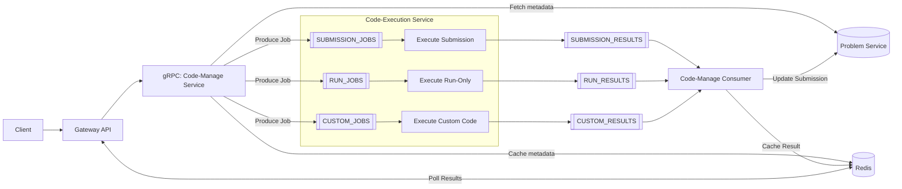
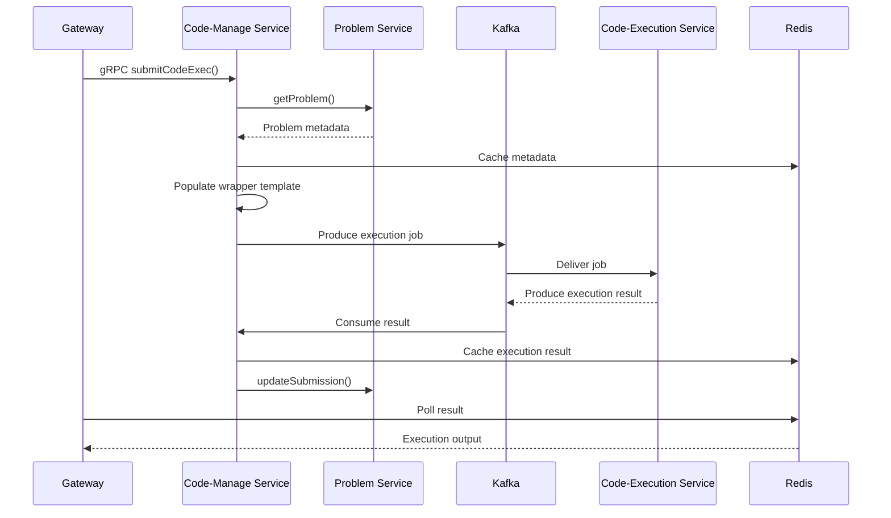
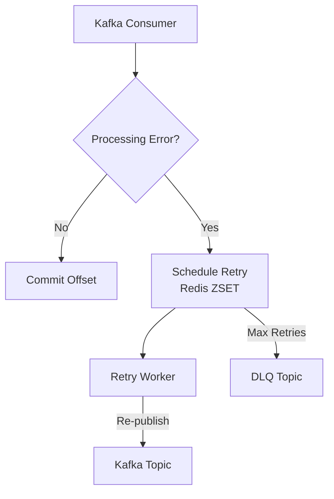

# Codex Code-Manage Service

The Code-Manage Service is the execution-orchestration layer of the Codex platform. It does **not execute any code**. Its sole responsibility is to validate execution requests, generate execution jobs and route them through Kafka to the Code-Execution Service, then receive execution results and propagate them to Redis and the Problem Service.

This service forms the backbone of Codex’s asynchronous execution pipeline.

---

## 1. Service Overview

The Code-Manage Service plays three core roles:

1. **gRPC Server** for the Gateway Service
2. **Kafka Producer** for execution job creation
3. **Kafka Consumer** for execution result handling

It also manages retry queues and a Dead Letter Queue (DLQ) to ensure fault-tolerant execution workflows.

---

## 2. Responsibilities

### Core Responsibilities

* Validate execution requests
* Fetch problem metadata via gRPC with Redis caching
* Populate execution wrapper templates for:

  * Submission execution jobs
  * Run-only execution jobs
  * Custom code execution jobs
* Produce execution jobs to Kafka
* Consume execution results from Kafka
* Cache execution results in Redis for Gateway polling
* Update the Problem Service via gRPC for final submission status
* Manage retry queue, DLQ and backoff worker

### Not Responsible For

* Running or executing code
* Compiling or interpreting user programs
* Executing test cases
* Sandbox isolation or security
* Measuring execution time or memory

All execution is handled exclusively by the **Code-Execution Service**.

---

## 3. Architecture Overview

### High-Level Flow

```
Client → Gateway → gRPC (Code-Manage)
        → Validate + enrich request
        → Fetch problem metadata
        → Populate wrapper template
        → Produce Kafka job

Code-Execution Service
        → Consumes job
        → Executes safely
        → Produces result

Code-Manage
        → Consumes result
        → Updates Redis
        → Updates Problem Service (submissions only)
        → Gateway polls Redis for results
```

---

## 3.1 End-to-End Execution Pipeline



---

## 3.2 Internal Code-Manage Flow



---

## 3.3 Retry Queue and DLQ



---

## 4. Folder Structure (Simplified)

```
src/
  config/            # tracing, metrics, redis, DI
  dtos/              # request/response DTOs
  libs/kafka/        # kafka manager, topics, retry logic
  services/          # producer and consumer services
  providers/         # redis cache provider
  transport/grpc/    # gRPC server and handlers
  utils/             # logging, sanitization, templates
  workers/           # retry worker instance
```

---

## 5. Execution Types

### Submission Execution

1. Gateway sends gRPC request
2. Request validation and sanitization
3. Fetch problem metadata (cached)
4. Populate submission wrapper template
5. Produce job to `SUBMISSION_JOBS`
6. Consume result from `SUBMISSION_RESULTS`
7. Cache result and update Problem Service

### Run-Only Execution

* No submission record created
* Jobs sent to `RUN_JOBS`
* Results cached for Gateway polling

### Custom Execution

* Independent code execution
* Jobs sent to `CUSTOM_JOBS`
* Results returned via `CUSTOM_RESULTS`

---

## 6. Kafka Subsystem

### Topics

```
SUBMISSION_JOBS
SUBMISSION_RESULTS
RUN_JOBS
RUN_RESULTS
CUSTOM_JOBS
CUSTOM_RESULTS
RETRY_QUEUE
DLQ_QUEUE
```

### KafkaManager

KafkaManager is a centralized orchestration layer responsible for:

* Producer, consumer and admin lifecycle
* Topic creation
* Consumer group management
* Retry queue scheduling
* DLQ routing
* Exponential backoff with jitter
* Dedicated retry worker process
* Graceful shutdown

---

## 7. Redis Usage

Redis is used for:

* Problem metadata caching
* Execution result caching
* Submission result polling
* Idempotency control
* Retry queue coordination

---

## 8. Observability

### Tracing

* gRPC server spans
* Kafka producer and consumer spans
* Redis operations

### Metrics

* gRPC latency and error rates
* Kafka consumer lag
* Retry queue depth
* Job throughput

### Logging

* Structured Pino logs
* userId, problemId, submissionId
* End-to-end execution lifecycle

---

## 9. CI/CD Pipeline

```
Push to dev/feature
→ GitHub Actions (lint, type-check, build)
→ Merge to main
→ Build & push Docker image
→ ArgoCD Image Updater
→ GKE rolling deployment
```

No manual deployment steps.

---

## 10. Local Development

Install dependencies:

```
npm install
```

Run locally:

```
npm run dev
```

Build:

```
npm run build
```

Docker build:

```
docker build -t codex/code-manage-service .
```

---

## 11. License

MIT
