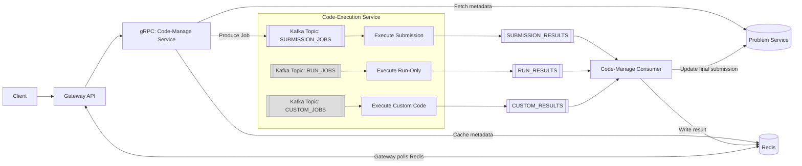
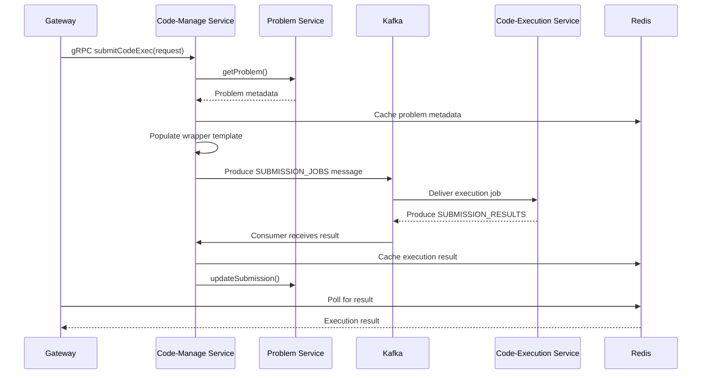
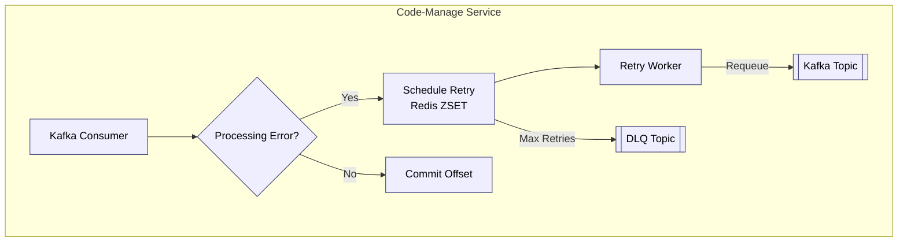

# Codex Code‑Manage Service

The Code‑Manage Service is the execution‑orchestration layer of the Codex platform. It does **not execute any code**. Its sole purpose is to validate execution requests, generate execution jobs and route them through Kafka to the Code‑Execution Service, then receive results and propagate them back into Redis and the Problem Service.

This service forms the core of Codex's asynchronous execution pipeline.

---

## 1. Service Overview

The service performs three main roles:

1. **gRPC Server** for the Gateway.
2. **Kafka Producer** for creating execution jobs.
3. **Kafka Consumer** for receiving execution results.

It also supports retry queues plus DLQ for stable processing.

---

## 2. Responsibilities

### Core Responsibilities

* Validate execution requests.
* Fetch problem metadata via gRPC (with Redis caching).
* Populate execution wrapper templates for:
  * Submission execution jobs
  * Run‑only execution jobs
  * Custom code execution jobs
* Produce execution jobs to Kafka.
* Consume execution results from Kafka.
* Write results to Redis for Gateway polling.
* Update Problem Service via gRPC for final submission status.
* Manage retry queue, DLQ and backoff worker.

### Not Responsible For

* Running code.
* Compiling or interpreting user programs.
* Executing testcases.
* Applying sandbox security.
* Measuring memory or execution time.

Execution is fully handled by **Code‑Execution Service**.

---

## 3. Architecture Overview

```
Client → Gateway → gRPC (Code‑Manage)
        → Validate + enrich request
        → Fetch problem metadata
        → Populate wrapper template
        → Produce Kafka job

Code-Execution-Service
        → Consumes job
        → Executes safely
        → Produces result

Code‑Manage
        → Consumes result
        → Updates Redis
        → Updates Problem Service (submissions only)
        → Gateway polls Redis for results
```

### 3.1 End-to-End Execution Pipeline



### 3.2 Internal Code-Manage Flow



### 3.3 Retry Queue + DLQ System



Client → Gateway → gRPC (Code‑Manage)
→ Validate + enrich request
→ Fetch problem metadata
→ Populate wrapper template
→ Produce Kafka job

Code-Execution-Service
→ Consumes job
→ Executes safely
→ Produces result

Code‑Manage
→ Consumes result
→ Updates Redis
→ Updates Problem Service (submissions only)
→ Gateway polls Redis for results

```

### Folder Layout (Simplified)
```

src/
config/            # tracing, metrics, redis, DI
dtos/              # request/response DTOs
libs/kafka/        # kafka manager, topics, retry
services/          # producer + consumer services
providers/         # redis cache provider
transport/grpc/    # gRPC server + handlers
utils/             # logging, sanitization, templates
workers/           # retry worker instance

```

---

## 4. Execution Flow

### A) Submission Execution
1. Gateway → gRPC request.
2. Validate code, sanitize input.
3. Fetch problem metadata via gRPC → cached in Redis.
4. Populate language‑specific “submission wrapper template”.
5. Produce Kafka message to `SUBMISSION_JOBS`.
6. Code‑Execution‑Service executes and pushes result to `SUBMISSION_RESULTS`.
7. Code‑Manage consumes result, writes to Redis and updates Problem Service.

### B) Run‑Only Execution
Same flow as submission but without creating a submission record.
Jobs go to `RUN_JOBS`.
Results cached for Gateway polling.

### C) Custom Execution
Used for non‑problem code execution.
Jobs go to `CUSTOM_JOBS`.
Returned via `CUSTOM_RESULTS`.

---

## 5. Kafka Subsystem

### Topics
```

SUBMISSION_JOBS → submitted code execution requests
SUBMISSION_RESULTS → execution results
RUN_JOBS → run‑only requests
RUN_RESULTS → run‑only results
CUSTOM_JOBS → custom code requests
CUSTOM_RESULTS → custom code results
RETRY_QUEUE → redis‑based retry scheduling
DLQ_QUEUE → dead‑lettered messages

```

### KafkaManager
A full orchestration abstraction handling:
* producer and admin connections
* consumer creation
* retry queue scheduling
* DLQ routing
* exponential retry with jitter
* worker process for draining retry queue
* dynamic broker reload
* graceful shutdown

### Retry & DLQ
If consumer processing fails:
* message is pushed to **retry queue**
* exponential backoff determines next retry time
* worker process drains retry queue and re‑publishes message
* after max retries, message goes to **DLQ**

---

## 6. Redis Usage

Used for:
* Problem metadata caching
* Submission result caching
* Run‑only and custom code result caching
* Idempotency (avoid reprocessing consumers)
* Retry queue coordination

Gateway polls these caches for completion.

---

## 7. gRPC Structure

```

Gateway → CodeManageService
submitCodeExec()
runCodeExec()
customCodeExec()

Code‑Manage → ProblemService (client)
getProblem()
createSubmission()
updateSubmission()

```

Each handler delegates to ProducerService → produces Kafka job.

---

## 8. Observability

### Tracing
* gRPC server spans
* Redis operations
* Kafka operations

### Metrics
* Per‑handler latency, error count
* Kafka consumer lag
* Retry queue depth
* Job throughput

### Logging
* Structured logs with pino
* userId, problemId, submissionId
* processing lifecycle events

---

## 9. CI/CD Pipeline

```

Push to dev/feature → GitHub Actions (type-check + build)
↓
PR → main → production Docker image build
↓
Push image → Docker Hub
↓
ArgoCD Image Updater detects new tag
↓
GKE rolling update

```

No manual deployment steps.

---

## 10. Local Development

Install dependencies:
```

npm install

```
Run locally:
```

npm run dev

```
Build:
```

npm run build

```
Docker:
```

docker build -t codex/code-manage-service .

```

---

## 11. License
MIT

```
